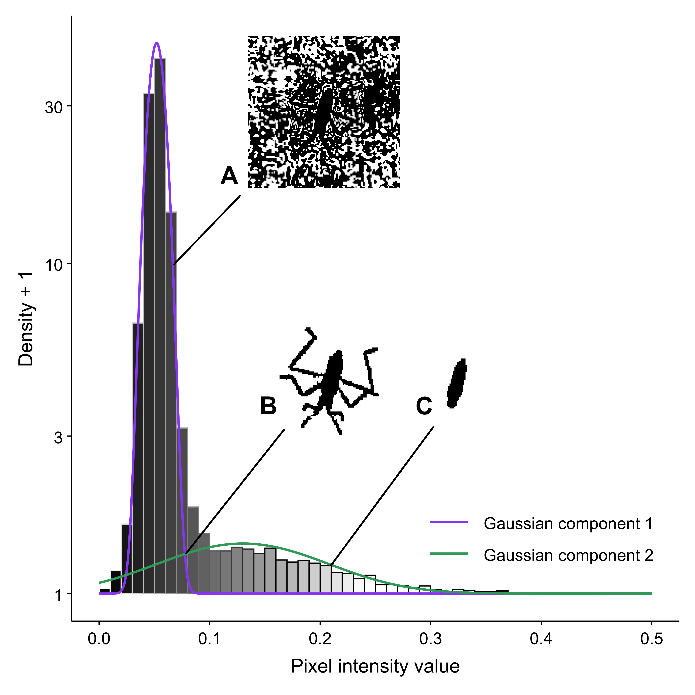
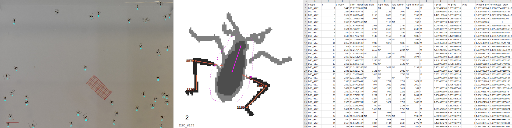

# Summary

Recent advances in omics data acquisition allows for unprencented characterisation of individual organisms at the molecular scale [@Dai:2022], which is vital to help understand phenotype in ecological and evolutionary studies. In this context, there is an ever growing need for high-throughput phenotyping tools [@Houle:2010] to create matching datasets. Deep Learning methods can prove to be limited in absence of extensive morphological training datasets available, while imposing limits on transparency and tunability [@Walsh:2019]. 

# Statement of need

`WaterStrideR` is an R package for automated hind leg segmentation, measurement and feature classification in Gerroidea-like arthropods from batches of 2D images. It was developped in response to specific needs from our lab for the specie *Microvelia longipes* (rephrase????HELP). This package aim to lift the restriction imposed by manual data acquisition on the amount arthropod individuals to be included the experiment protocol due to time limitations. Although Multiple tools for arthropod detection and segmentation are already available but they are either:
- Are only suited for specific species out of scope for our needs (FlyLimbTracker[@CITATION], FLLIT[@CITATION])
- Proven to be unstable on our data due to relatively low resolution per individual (MAPHIS[@CITATION])
- Not designed for part-level segmentation (FlatBug[@CITATION])

`WaterStrideR` was developed as an R package to facilitate use by the eco-evolutionary biologist community and fit conveniently in typical analysis workflows. Its use is mainly intended in future publications from research teams aready working with water striders phenotypic data as it extracts features relevant to these species ecology [@Toubiana:2021].

# Concept and implementation
WaterStrideR implements a hierarchical segmentation pipeline combining traditional computer vision with statistical modeling. 

## Aims 

1. For water striders or similar insects: hind leg and body segmentation and measurements with hind leg joint landmarking when legs do not overlap with other objects.
2. For *Microvelia longipes*: prediction of sex and presence of wings.

## Pipeline overview

- Auto-scaling: automatic conversion from pixels to micrometers using a red graph-paper reference.
- Body segmentation: user-defined binary threshold and morphological cleaning (imager[@CITATION]).
- Limb segmentation: Gaussian mixture modeling (mclust[@CITATION]) to separate limbs from background noise \autoref{fig:GMM}.
- Orientation: body elongation and relative limb position estimated via PCA.
- Joint landmark detection: based on local orientation and angular variation along the limb contour.
- Model training: LDA classification of sex and wing features from contour-based descriptors (Momocs[@CITATION]).

{ width="75%" }

## Workflow

1. Define a fixed image acquisition protocol. The setup used to create data for this package is detailed in [@HOWTOCITETHEVIGNETTE???]
2. Adjusting pipeline parameters is required for each new setup. Tuning protocol is detailed in [@HOWTOCITETHEVIGNETTE???]
3. `WaterStrideR` can now be run on batches of images by inputing tuned parameters and an image folder path to the `gRunPipeline()` function.
4. Evaluation, overview and filtering are facilitated by clear graphical outputs created in parent directory of input image folder \autoref{fig:outs }.

{ width="100%" }

# Validation

# Acknowledgements

# References

omics [@Dai:2022]
https://www.frontiersin.org/journals/medicine/articles/10.3389/fmed.2022.911861/full
phenomics [@Houle:2010]
https://pubmed.ncbi.nlm.nih.gov/21085204/
computer visions VS DL [@Walsh:2019]
https://www.researchgate.net/publication/331586553_Deep_Learning_vs_Traditional_Computer_Vision

water strider long legs [@Toubiana:2021]
https://journals.plos.org/plosbiology/article?id=10.1371/journal.pbio.3001157

to fulfill two main purposes:

## Hind legs segmentation and measurements
For water striders or similar insects, `WaterStrideR` allows for legs segmentation and measurements with landmarking of the first two joints when legs are not overlapping with objects such as other legs or individual's bodies. The workflow combines a user-defined initial binary threshold for coarse body isolation with an automatic scaling procedure that achieves sub-pixel precision following our simple protocol, requiring only a small piece of red graph paper.

