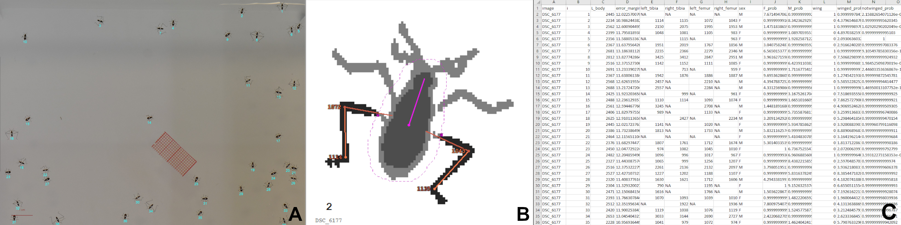

# Summary

Recent advances in omics data acquisition allow for unprecedented characterization of individual organisms at the molecular scale [@Dai:2022], which is vital to help understanding phenotype in ecological and evolutionary studies. In this context, there is a growing need for high-throughput phenotyping tools [@Houle:2010] to create matching datasets. Deep Learning methods can prove to be limited in absence of extensive morphological training datasets available, while imposing limits on transparency and tunability [@OMahony:2019]. `WaterStrideR` addresses these challenges through a transparent, tunable pipeline combining traditional computer vision with statistical modeling.
 
# Statement of need

`WaterStrideR` is an R package for automated hind leg segmentation, measurement and feature classification in Gerroidea-like arthropods from batches of 2D images. It was developed in response to specific needs from our lab for the species *Microvelia longipes* (rephrase????HELP). This package aims to lift the restriction imposed by manual data acquisition on the number of arthropod individuals to be included in experiment protocols due to time limitations. Although Multiple tools for arthropod detection and segmentation are already available, but they are either:
- Only suited for specific species out of scope for our needs (FlyLimbTracker, [@Uhlmann:2017])
- Proven to be unstable on our data due to relatively low resolution per individual (MAPHIS, [@Mraz:2024])
- Not designed for part-level segmentation (FlatBug, [@Svenning:2025])

`WaterStrideR` was developed as an R package to facilitate use by the eco-evolutionary biologist community and fit conveniently in typical analysis workflows. Its use is mainly intended in future publications from research teams already working with water striders phenotypic data as it extracts features relevant to these species' ecology [@Toubiana:2021].

# Concept and implementation
WaterStrideR implements a hierarchical segmentation pipeline combining traditional computer vision with statistical modeling. 

## Aims 

1. For water striders or similar insects: hind leg and body segmentation and measurements with hind leg joint landmarking when legs do not overlap with other objects.
2. For *Microvelia longipes*: prediction of sex and presence of wings.

## Pipeline overview

- Automatic scaling: automatic conversion from pixels to micrometers using a red graph-paper reference.
- Body segmentation: user-defined binary threshold and morphological cleaning (imager, [@imager]).
- Limb segmentation: Gaussian mixture modeling (mclust, [@mclust]) to separate limbs from background noise.\autoref{fig:GMM}.
- Orientation: body elongation and relative limb position estimated via PCA.
- Joint landmark detection: based on local orientation and angular variation along the limb contour.
- Model training: LDA classification of sex and wing features from contour-based descriptors (Momocs, [@Momocs]).

{ width="75%" }

## Workflow

1. Define a fixed image acquisition protocol. The setup used to create data for this package is detailed in "getting-started" vignette.
2. Parameter adjustment is required for each new setup. Tuning protocol is detailed in the "parameter-tuning" vignette.
3. `WaterStrideR` can now be run on batches of images by inputing tuned parameters and an image folder path to the `gRunPipeline()` function.
4. Evaluation, overview and filtering are facilitated by clear graphical outputs created in parent directory of input image folder \autoref{fig:outs }.

{ width="100%" }

# Performance
`WaterStrideR` enables processing of hundreds of individuals in minutes compared to hours of manual measurement, while maintaining high accuracy (r = 0.982 for femur length). Performance was tested on 6 images containing a total of 269 individuals, produced following the protocol described in the "getting-started" vignette.

**Detection**: Out of 269 manually counted individuals, 262 (97.4%) were detected using `WaterStrideR` default parameters. All undetected individuals were heavily affected by motion blur. No noise was falsely detected as an individual.

**Leg landmarking**: 78.2% of these individuals had at least one hind leg measured.

**Leg measurement**: Femur length was measured manually in 205 individuals, yielding a Pearson correlation coefficient of 0.982 ($p < 0.001$, 95% CI = [0.970, 0.989]) with `WaterStrideR` output.

**Feature prediction**: Feature prediction for sex and wing presence was tested using leave-30%-out cross-validation with 1000 samples on individuals for which these features could be determined. 
- Sex: 98.80% prediction accuracy (95% CI = [0.988, 0.988]) on 249 individuals.
- Wing: 99.56% prediction accuracy (95% CI = [0.996, 0.996]) on 249 individuals.

## Limitations
- Inability to compute overlapping legs might lead to bias against male individuals, which have longer legs.
- The specifics of our leg landmarking implementation makes it unsuitable for species with less than 3 distinguishable hind leg segments.
- Feature prediction was trained only on our specific data acquisition protocol and might thus not be generalizable for any *Microvelia longipes* image. 

# Acknowledgements

We acknowledge Claudia Pruvôt for providing water strider image data and assistance with trait identification. We also thank Abderrahman Khila and Nicolas Goudemand for their trust in this project and their oversight.

# References