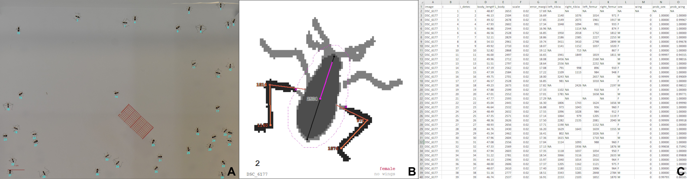

# Summary

Recent advances in omics data acquisition allow for unprecedented characterization of individual organisms at the molecular scale [@dai_advances_2022], increasing the need for high-throughput phenotyping approaches to generate complementary organism-level datasets [@houle_phenomics_2010]. However, deep learning-based methods can require extensive morphological training datasets, while imposing limits on transparency and tunability [@omahony_deep_2020]. `WaterStrideR` addresses these challenges through a transparent, tunable pipeline combining traditional computer vision with statistical modelling and supervised classification. Given photographs in which insects are contrasted against a lighter background, this package enables automated extraction of biological traits associated with growth, reproduction, and fighting behaviour.
 
# Statement of need

`WaterStrideR` is an R package for image-based mass phenotyping of Gerroidea-like arthropods. Its main purposes are automating detection of individuals, measurement of hind leg segments and body length, along with classification of sex and wing presence. It can be applied to batches of 2D photographs of insect groups, provided that individual insects have a body length of at least 30 pixels. It also enables automated precision scaling when red graph paper is included in the image.
This package was first developed to address needs of the Khila lab (IGFL, ENS de Lyon, France) using the species *Microvelia longipes* as the primary study species. However, its design may also allow application in many other arthropod taxa with appropriate parameter adjustments.
Manual data acquisition is time consuming and prone to introducing uncontrolled sampling biases. For example, a single ongoing dataset in our lab comprises on the order of 30,000 individuals across ~1,000 images — a scale that is impractical to measure manually. Therefore, several tools have been already developed to automate insect phenotyping, but existing approaches did not meet the specific requirements of our application. FlyLimbTracker [@uhlmann_flylimbtracker_2017] is designed for a more specific use case, while FlatBug [@svenning_general_2025] and InsectMorphoAI [@shirali_insectmorphoai_2026] do not allow for leg segmentation. MAPHIS [@mraz_maphismeasuring_2024], in contrast, is designed for higher-resolution images than those used in our application.

`WaterStrideR` was developed as an R package to facilitate its use by the eco-evolutionary biologist community and to fit conveniently in typical analysis workflows. It is mainly intended for people working with water striders, but as mentioned above, some minor parameter adjustments may extend its applicability to other arthropod taxa.

# Concept and implementation
WaterStrideR implements a hierarchical segmentation pipeline combining traditional computer vision with statistical modeling. 

## Aims 

1. For water striders and similar insects on lighter background: segment and orient all individuals within a group image.
2. When hind legs do not overlap with other objects: segment hind legs, identify their joints, and measure femur and tibia lengths.
3. For *Microvelia longipes*: predict sex and wing presence.

## Pipeline overview

- Automated scaling: when a piece of red graph paper is included in the image: an algorithm computes a scaling factor using segmented elements of the grid. In that case, the pipeline will return measurements converted from pixels to millimeters. Note that ‘WaterStrideR’ also includes an interactive manual scaling function.
- Semi-automated insect and body segmentation: a user-defined binary threshold is used to segment and label all the insects present in the image; for each individual, a new, small, specimen-centered image is created that is centered around that individual; the body of each individual is segmented and ‘cleaned’ using operations of mathematical morphology (imager, [@barthelme_imager_2024]).
- Automated limb segmentation: in each specimen image, a Gaussian mixture model (mclust, [@scrucca_model-based_2023]) is used to separate the limbs from the local background noise.\autoref{fig:GMM}.
- Automated detection of the antero-posterior axis: the orientation of each individual is estimated via PCA using its body elongation.
- Automated orientation: the polarity of the A-P axis is determined using a statistical classification model based on limb position and body shape descriptors (Momocs, [@bonhomme_momocs_2014]).
- Automated detection of the hind leg segments: a local measure of angular variation is computed along the contour of the hind leg and used to detect the straight segments and their joints. Several tests are run to detect if a leg is in a configuration that prevents measurement, typically if its legs are superimposed on the legs of another individual. Whenever possible, one or the two femurs and tibias are detected and measured. 
- Automated classification: the same body contour descriptors used for orientation are used to predict the sex and the absence/presence of wings in all individuals, based on LDAs performed on a training set. 

{ width="75%" }

## Workflow

1. Acquire images with insects contrasted against a lighter background. The "getting-started" vignette details the type of input data that is expected.
2. Parameter adjustment may be necessary for any new setup. The "parameter-tuning" vignette explains how the parameters may be optimized for your own setup.
3. `WaterStrideR` can then be run on all images from a given folder and using given ‘adjusted’ parameters by calling the `gRunPipeline()` function.
4. Several graphical outputs are created within the parent directory of the input image folder that allow for quality control \autoref{fig:outs }.

{ width="100%" }

# Performance
`WaterStrideR` can process hundreds of individuals in a few minutes, whereas manual measurement would require substantially more time. We evaluated the pipeline on six images containing 269 individuals, following the image acquisition conditions described in the "getting-started" vignette.

**Detection**: Out of the 269 manually counted individuals, 262 (97.4%) were detected using `WaterStrideR`’s default parameters. All the undetected individuals were heavily affected by motion blur. No false positive has been observed. 

**Orientation**: Every individual was successfully oriented during this test.

**Leg landmarking**: 78.2% of these individuals had at least one hind leg measured.

**Leg measurement**: Femur length was measured manually in 205 individuals, yielding a Pearson correlation coefficient of 0.982 ($p < 0.001$, 95% CI = [0.970, 0.989]) with `WaterStrideR`’s outputs.

**Feature predictions**: predictions for sex and for presence/absence of wings was tested using leave-30%-out cross-validation with 1000 samples on individuals for which these features could be determined. 
- Sex: 98.80% prediction accuracy on 249 individuals.
- Wing: 99.56% prediction accuracy on 249 individuals.

## Limitations
- Because hind leg length differs between sexes in Microvelia longipes, this may introduce sex- and size-dependent measurement bias in crowded images where leg overlap is frequent.
- The specifics of our leg landmarking implementation makes it unsuitable for species with less than 3 distinguishable hind leg segments.
- Feature prediction was trained only on our specific data acquisition protocol with default parameters and hence we cannot assure its accuracy if another setup is used. 
- Individual water striders may occasionally adopt a tilted posture, which can affect feature classification and morphological measurements. Such cases are not automatically detected and must be identified manually using the output figures.

# Acknowledgements

We acknowledge Claudia Pruvôt for providing water strider image data and assistance with trait identification. We also thank Abderrahman Khila and Nicolas Goudemand for partial funding of this project, and for supervision.

# References
