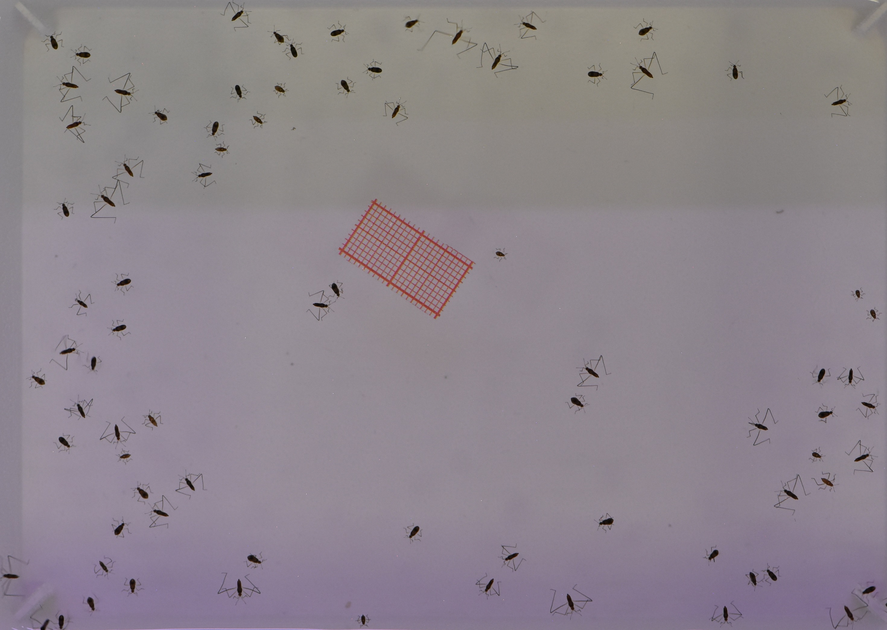

```{r, include = FALSE}
knitr::opts_chunk$set(
  collapse = TRUE,
  comment = "#>"
)
```

## Introduction

`WaterStrideR` provides tools for the automated analysis of group images of 
water striders and similar arthropods. The package can fulfill three main
purposes, depending on your data and research needs:

1.  **Body/Leg segmentation and measurements** - Extract hind leg
    measurements, body dimensions, and individual positions
2.  **Sex and wing prediction** - Predict sex and wing presence in
    *Microvelia longipes* (trained models)
3.  **Automatic scaling** - If the image contains a piece of red graph paper, 
the latter is segmented and used to compute a scale automatically.

**Important:** This protocol of automated analysis requires input data to match certain criteria. This package is best suited for high-throughput phenotyping where you can maintain consistent imaging protocols conditions across many images and individuals.

## Is WaterStrideR Right for Your Study?

`WaterStrideR` is designed for arthropods where:

-   2D top-view images are sufficient for leg measurements
-   You have (or can establish) a standardized imaging setup
-   You need to process many individuals (batch processing)
-   Your target organisms belong to Gerroidea or have similar body plans

## Installation

```{r eval=FALSE}
#Install the 'remotes' package, which is required for the installation from GitHub
install.packages("remotes")

#Install the package
remotes::install_github("arthurgc-sci/WaterStrideR",
                        build_vignettes = TRUE) #skip if you don't need vignettes

# Load the package
library(WaterStrideR)
```

## Input Data Requirements

### 1A. Body and Hind Leg Segmentation and Measurements

**Use case:** Extract morphological measurements from water striders or
similar arthropods.

**Input path** Either:

-   A path to a single image (jpeg, jpg, tif, png, bmp, gif)
-   A path to a folder containing one or more images

```{r eval=FALSE}
results <- gRunPipeline(
  "path/to/image(s)",
  auto_scale = FALSE, #red graph paper protocol
  predict_sex_wing = FALSE #Only for M.longipes
)
```
Wait until all the steps below are completed:
```{r eval=FALSE}
#1 - Loading and segmenting image
#| 
#2 - Computing scale
#|                                                                                                                                          
#3 - Computing body
#| 
#4 - Individual thresholding
#|                                                                                                                                          
#5 - Orienting individuals
#| 
#6 - Leg segmentation
#| 
#7 - Leg landmarking & measurement
#|                                                                                                                                          
#8 - Sex and wing prediction #OPTIONAL
#>
```

**Requirements:**

-   Top-view images with visible legs
-   Contrast between dark individuals and a lighter background
-   Legs at least 2 pixels thick
-   Most individuals not overlapping with each other

**Outputs:**

-   Individual detection and position
-   Body length measurement
-   Femur and tibia length measurements for the hind legs

### 1B. Sex and Wing Detection for *Microvelia longipes*

**Use case:** Predict sex and presence/absence of wings using pre-trained
classification models.

```{r eval=FALSE}
results <- gRunPipeline(
  "path/to/image(s)",
  predict_sex_wing = TRUE
)
```

**⚠️ Important:** Models were trained on images of  *M. longipes* acquired
following the specific protocol described below (Section 2.2). Predictions using 
images from a different protocol or using a distinct species may be unreliable. 
Use with caution and cross-validate results.

### 1C. Scaling Method

**Use case:** Chose between manual interactive scaling, or automatic scaling if
a piece of red graph paper of at least 1×1cm is included in your images

```{r eval=FALSE}
results <- gRunPipeline(
  "path/to/images",
  auto_scale = TRUE #switch to FALSE for interactive manual scaling
)
```

**Requirements:** 

- Include a piece of red or orange millimetric graph paper in each image
- The graph paper must be within the depth-of-field
- Small squares (1mm) should be resolved
- 2cm² of graph paper is sufficient (larger areas reduce performance)

**Tuning:** If the ruler detection fails, adjust `f.red_thresh` in 
`gRunPipeline`.

## Data Acquisition Protocols

### 2.1 General Setup for Arthropods

**Minimum requirements:**

-   **Lighting:** Homogeneous, diffuse lighting (avoid shadows and
    glare)
-   **Camera angle:** Directly overhead (perpendicular to specimen
    plane)
-   **Background:** White or light-colored, uniform background
-   **Resolution:** Legs should be at least 2 pixels thick
-   **Positioning:** Specimens in natural posture, legs extended when possible

**Note on optical aberrations** WaterStrideR does not correct for optical 
aberrations. If these distortions affect measurement accuracy, of the camera or 
of the optical setup in general may be needed.

### 2.2 Strict Protocol (*M. longipes* and Optimal Performance)

`WaterStrideR` was specifically tuned and validated using the following
protocol:

**Image specifications:**

- Resolution: 1900-3500 pixels per dimension (200-250px/cm)
- File size: 500-900 KB
- DPI: 300
- Color depth: 24-bit

**Camera settings (Nikon D7200):**

- ISO: 800 - Aperture: f/6.3
- Shutter speed: 1/160 sec
- Exposure compensation: 0
- Flash: Off

**Physical setup:**

- White rectangular plastic rack: \~12 × 16 cm
- Lighting: Diffuse neon white light

```{r echo=FALSE, out.width="100%", fig.align='center'}

```

**Note:** While this protocol ensures optimal performance,
`WaterStrideR` may work with images from other setups owing to proper parameter 
tuning.

See the **Parameter Tuning vignette** for detailed instructions:

```{r eval=FALSE}
vignette("parameter-tuning", package = "WaterStrideR")
```

### 2.3 Protocol for Automatic Scaling

To enable automatic scale detection:

1.  **Add graph paper:** Place a small piece of red or orange
    millimetric graph paper in the frame
2.  **Size:** 2cm² is sufficient and recommended (larger pieces slow
    processing for a marginal increase in achieved precision)
3.  **Position:** Ensure graph paper and specimens are within the depth-of-field
4.  **Visibility:** 1mm grid squares must be resolved (distinguishable)
5.  **Color:** Red or orange paper works best (high red channel value)

**Enable in pipeline:**

```{r eval=FALSE}
results <- gRunPipeline(
  "path/to/image(s)",
  auto_scale = TRUE,
  f.red_thresh = 0.5  # Adjust if ruler detection fails
)
```

## Workflow Overview

### Step 1: Acquire Images Following Protocol

Follow the appropriate protocol from Section 2 above based on your
needs.

### Step 2: Tune Pipeline Parameters

**⚠️ Critical Step:** Parameter tuning is required for \~90% of use
cases.

Before processing your full dataset, calibrate `WaterStrideR` for your
specific:

- Organism's morphology
- Imaging conditions

See the **Parameter Tuning vignette** for detailed instructions:

```{r eval=FALSE}
vignette("parameter-tuning", package = "WaterStrideR")
```

### Step 3: Run Pipeline

Process a single image or batch of images:

```{r eval=FALSE}
# Single image
results <- gRunPipeline(
  "path/to/image.jpg",
  write_output = TRUE
)

# Batch processing (folder of images)
results <- gRunPipeline(
  "path/to/folder/",
  write_output = TRUE
)
```

**Parameters:**

- `return_df = TRUE`: Returns a data frame with
measurements, this is the default
- `write_output = TRUE`: Saves graphical outputs as .png files for quality 
control and the results data frame as a .csv file

### Step 4: Validate Results

`WaterStrideR` creates graphical outputs linked to the measurement data
frame, allowing for easy quality checks.

See the **Interpreting Outputs vignette** for details:

```{r eval=FALSE}
vignette("interpreting-outputs", package = "WaterStrideR")
```

## Getting Help

-   **Bug reports:** [GitHub
    Issues](https://github.com/arthurgc-sci/WaterStrideR/issues)
-   **Questions:** Open a discussion on GitHub
-   **Citation:** See `citation("WaterStrideR")` once JOSS paper is
    published

## References

For methodology details, see the JOSS paper: [link once published]
