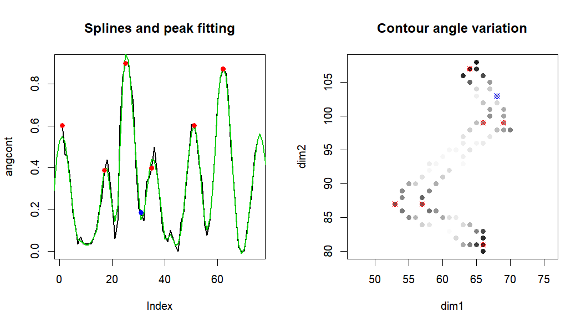

```{r, include = FALSE}
knitr::opts_chunk$set(
  collapse = TRUE,
  comment = "#>"
)
```

```{r setup}
library(WaterStrideR)
```

## Introduction

**Parameter tuning is required for \~90% of use cases.** Each
acquisition protocol requires calibration to account for differences in
organism morphology, image resolution, lighting conditions, and camera
settings.

**Prerequisite**: Read `vignette("getting-started")`

### Tuning Workflows

**Two approaches:**

1.  **Visual tuning:** Run pipeline with graphical outputs
    `write_output = TRUE`, adjust parameters based on plots
2.  **Mid-step tuning:** Use individual functions with `viz = TRUE` to
    isolate each processing stage. If needed, get input for these
    functions with `return_everything = TRUE` then `your_results$process_data`.

**If unsure where problems occur, tune parameters in the order presented
below.**

### Documentation

-   **Output interpretation:** `vignette("interpreting-outputs")`
-   **Parameter details:** `?gPipeline` (gRunPipeline is a wrapper
    around gPipeline)

### Parameter Naming Convention

-   `k.` prefix = **key variable** (most impactful parameters)
-   `f.` prefix = **filter parameter** (secondary adjustments)

This vignette covers key variables only using the most efficient tuning
methods.

------------------------------------------------------------------------

## Body Segmentation

### 1. Initial Binary Threshold (`k.bin_thresh`)

**Purpose:** Convert grayscale image to binary (body vs. background)

**Tuning:**

```{r eval=FALSE}
# Load example image
ex1 <- system.file("extdata", "small_test.jpg", package = "WaterStrideR")

# Test different thresholds
img_high <- binaryLoad(ex1, threshold = 0.8)
plot(img_high)  # Too high: incomplete bodies

img_low <- binaryLoad(ex1, threshold = 0.4)
plot(img_low)   # Too low: legs visible and connected to body

img_good <- binaryLoad(ex1, threshold = 0.6)
plot(img_good)  # Ideal: clean body separation
```

**Goal:** Bodies fully segmented, legs absent or visually separated

**Set parameter:**

```{r eval=FALSE}
gRunPipeline(..., k.bin_thresh = 0.6)
```

------------------------------------------------------------------------

### 2. Body Size Range (`k.body_size_px_range`)

**Purpose:** Filter detected objects by size to exclude noise and
non-target objects

**Tuning:**

```{r eval=FALSE}
# Load and threshold image
ex1 <- system.file("extdata", "small_test.jpg", package = "WaterStrideR")
img1 <- binaryLoad(ex1, threshold = 0.6)

# Test size filters
gFastSeg(img1, px_range = c(0, 10e5), viz = TRUE)     # Many small artifacts
gFastSeg(img1, px_range = c(300, 10e5), viz = TRUE)   # Clean: only bodies remain
```

**Goal:** Retain all target bodies, exclude background noise

**Set parameter:**

```{r eval=FALSE}
gRunPipeline(..., k.body_size_px_range = c(300, 10e5))
```

------------------------------------------------------------------------

### 3. Morphological Cleaning (`k.clean_kernel`)

**Purpose:** Remove small holes and smooth body edges

**Tuning:**

```{r eval=FALSE}
# Run pipeline with return_everything to access intermediate data
results <- gRunPipeline(..., return_everything = TRUE)

# Visualize cleaned body for individual i
i <- 5  # Choose an individual to inspect
plot(results$process_data$body_img[[i]])
```

**Decision rules:**

- **If holes visible in body:** Increase `k.clean_kernel`
- **If body shape details lost:** Decrease `k.clean_kernel`

**Set parameter:**

```{r eval=FALSE}
gRunPipeline(..., k.clean_kernel = 3)  # Adjust as needed
```

------------------------------------------------------------------------

### 4. Crop Size (`k.crop_size_factor`)

**Purpose:** Define square region around body to capture legs

**Tuning:**

```{r eval=FALSE}
# Visualize cropped region for individual i
i <- 5
plot(results$process_data$full[[i]])
```

**Decision rule:**

- **If legs extend beyond crop:** Increase `k.crop_size_factor`

**Set parameter:**

```{r eval=FALSE}
gRunPipeline(..., k.crop_size_factor = 2.5)  # Adjust as needed
```

------------------------------------------------------------------------

## Automatic Scaling

### Red Threshold for Ruler Detection (`f.red_thresh`)

**Purpose:** Detect red graph paper based on red color intensity

**Tuning:**

```{r eval=FALSE}
# Load image
ex1 <- system.file("extdata", "small_test.jpg", package = "WaterStrideR")
img1 <- imager::load.image(ex1)

# Test threshold - plots detected ruler tiles
redRulerScale(img1, red_thresh = 0.02, viz = TRUE)
```

**Goal:** Maximize detected ruler tiles while avoiding false positives
(non-ruler red areas)

**Set parameter:**

```{r eval=FALSE}
gRunPipeline(..., f.red_thresh = 0.02, auto_scale = TRUE)
```

------------------------------------------------------------------------

## Leg Segmentation

**All leg segmentation parameters should be validated using individual
plots.**\
See `vignette("interpreting-outputs")` for plot location and interpretation.

### 1. GMM Threshold (`k.gmm_slope_value`)

**Purpose:** Separate legs from background noise using Gaussian Mixture
Model

**Tuning strategy:**

```{r eval=FALSE}
# Run pipeline and check individual plots
results <- gRunPipeline(..., write_output = TRUE, k.gmm_slope_value = -25)

```

**Decision rules:**

- `k.gmm_slope_value` more positive → **less inclusive** (cleaner but may lose thin legs)
- `k.gmm_slope_value` more negative → **more inclusive** (captures more legs but adds noise)

**Goal:** Full connected legs with minimal background noise

**Set parameter:**

```{r eval=FALSE}
gRunPipeline(..., k.gmm_slope_value = -25)  # Adjust based on noise level
```

------------------------------------------------------------------------

### 2. Body Dilation for Limb Separation (`k.body_dilation_ratio`)

**Purpose:** Expand body contour to intersect legs at their base for
separation

**Tuning strategy:**

```{r eval=FALSE}
# Run pipeline and check individual plots (violet outline = dilated body)
results <- gRunPipeline(..., write_output = TRUE, k.body_dilation_ratio = 0.3)

# Examine individuals_yourimg/*.jpg files
```

**Decision rules:** - **Dilated contour intersects legs mid-segment:**
Decrease `k.body_dilation_ratio` - **Contour doesn't reach leg bases:**
Increase `k.body_dilation_ratio`

**Goal:** Intersect legs at their base without cutting into body
segments (except rearmost appendages, which are tolerated)

**Set parameter:**

```{r eval=FALSE}
gRunPipeline(..., k.body_dilation_ratio = 0.3)  # Adjust as needed
```

------------------------------------------------------------------------

## Joint Landmark Detection

**Use the `gLegLandmarks()` function directly to tune these parameters
with visualization.**

### Setup for Landmark Tuning

```{r eval=FALSE}
# Run pipeline with full data
results <- gRunPipeline(..., return_everything = TRUE)

# Select individual and leg side to inspect
i <- 5
side <- "right"  # or "left"

# Extract leg data
legs <- results$process_data$legs[[i]][[side]]
inser <- results$process_data$inser[[i]][[side]]

# Run landmark detection with visualization
leg_lmk <- gLegLandmarks(
  leg_coords = legs,
  insertion = inser,
  viz = TRUE,           # Show diagnostic plots (validation and advanced parameters)
  msg = TRUE,           # Print diagnostic messages
  viz_angle = TRUE,     # Show angle variation plots (relevant for main parameters)
  search_w = 6,         # Parameter to tune
  n_splines = 30        # Parameter to tune
)
```
```{r echo=FALSE, out.width="100%", fig.align='center'}
# Include example detection plot

``` 

### 1. Angle Search Window (`k.leglm_search_w`)

**Purpose:** Define window range to detecting joint angle variations (require scaling with resolution)

**Diagnostic plot:** "Contour angle variation"

- Sharp angles plotted with darker hue
- Noise creates scattered dark points

**Decision rule:** Adjust `search_w` until **darker areas are smooth and centered around joints**

**Set parameter:**

```{r eval=FALSE}
gRunPipeline(..., k.leglm_search_w = 6)
```

------------------------------------------------------------------------

### 2. Spline Degrees of Freedom (`k.leglm_splines_df`)

**Purpose:** Smooth angle profile to identify joint peaks

**Diagnostic plot:** "Splines and peak fitting"

- Green trend line = fitted spline
- Should follow global trends without overfitting noise

**Decision rule:** Adjust `n_splines` until green curve produces **5-7
clear peaks**

**Set parameter:**

```{r eval=FALSE}
gRunPipeline(..., k.leglm_splines_df = 30)  # Typical range: 25-35
```

------------------------------------------------------------------------

## Complete Tuning Example
**Note**: Might be a bit slow due to larger file

```{r eval=FALSE}
# After tuning all parameters, run full pipeline:
ex2 <- system.file("extdata", "single_hd.jpg", package = "WaterStrideR")

results2 <- gRunPipeline(
  img_path = ex2,
  return_df = TRUE,
  # Outputs
  write_output = FALSE,
  auto_scale = FALSE, #manual scale
  predict_sex_wing = TRUE,
  return_everything = FALSE,
  # Body segmentation
  k.bin_thresh = 0.5,
  k.body_size_px_range = c(150000, 350000), 
  k.clean_kernel = 3,                     
  k.crop_size_factor = 3.5,
  # Complete body + leg segmentation
  k.body_dilation_ratio = 0.3,
  k.gmm_slope_value = -25,
  # Leg joints detection
  k.leglm_search_w = 110,                  
  k.leglm_splines_df = 30,
  # Additional parameter for leg landmarks algorithm, see '?gPipeline'
  f.leg_ankle_knee_thresh = .12 +.1,          
)
```
```{r echo=FALSE, out.width="50%", fig.align='center'}
# Include example detection plot
knitr::include_graphics("ex_img/out_ind_hd.png")
``` 


## Getting Help

For difficult tuning cases:

- Open a GitHub Issue with example images and current parameters
- Include details about your organism and imaging setup
- Describe which processing step is failing

