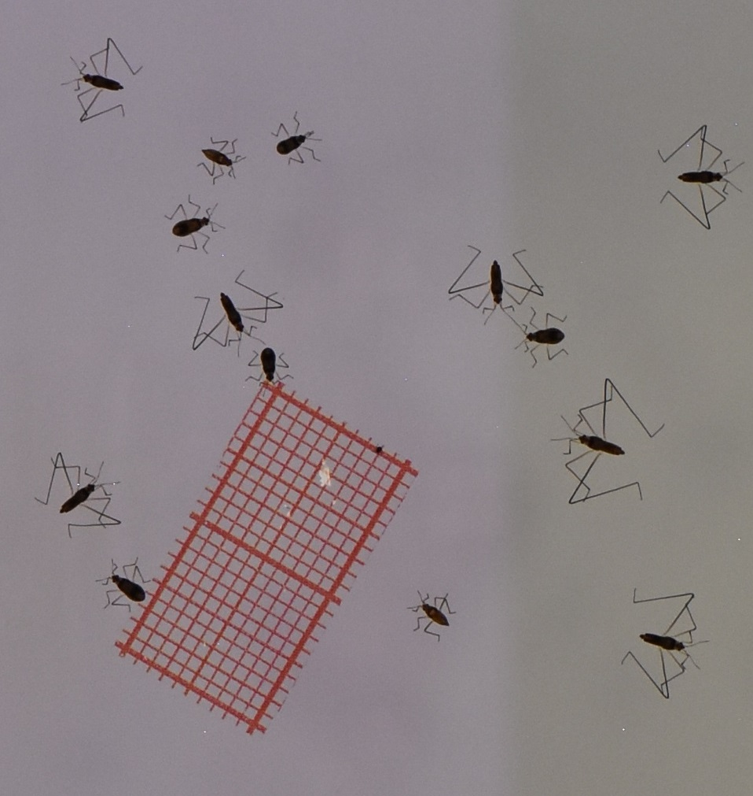

```{r, include = FALSE}
knitr::opts_chunk$set(
  collapse = TRUE,
  comment = "#>"
)
```

## Overview
Small text here, introduction to the package
Blablabla
OK ET LA CA MAAAAARCHE ? \n retour à la ligne je pense
a
b
c

a

b

c

## Installation
```{r setup}
library(WaterStrideR)
```

## Demo

### Load files

```{r}
single <- system.file("demodata", "single_hd.jpg", package = "WaterStrideR")
bunch <- system.file("demodata", "small_test.jpg", package = "WaterStrideR")
img1 <- imager::load.image(single)
img2 <- imager::load.image(bunch)
```

#### example code (not ran)

```r
example example code lmao this is not ran so no error here
 lmao
print(2+2)
print(2+"jul")
```

### Example images

<div style="display:flex; gap:6px; justify-content:center;">
  <figure style="margin:0;">
    
    <figcaption style="text-align:center;">Image 1 - Single</figcaption>
  </figure>
  <figure style="margin:0;">
    
    <figcaption style="text-align:center;">Image 2 - Bunch</figcaption>
  </figure>
</div>

### Run Pipeline
```{r}
print(2+2)
```
